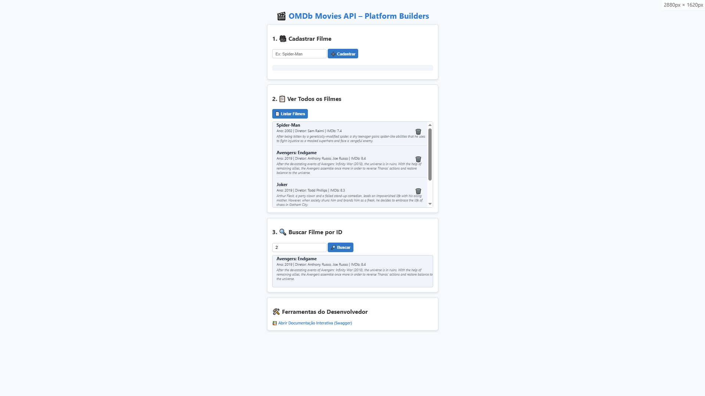
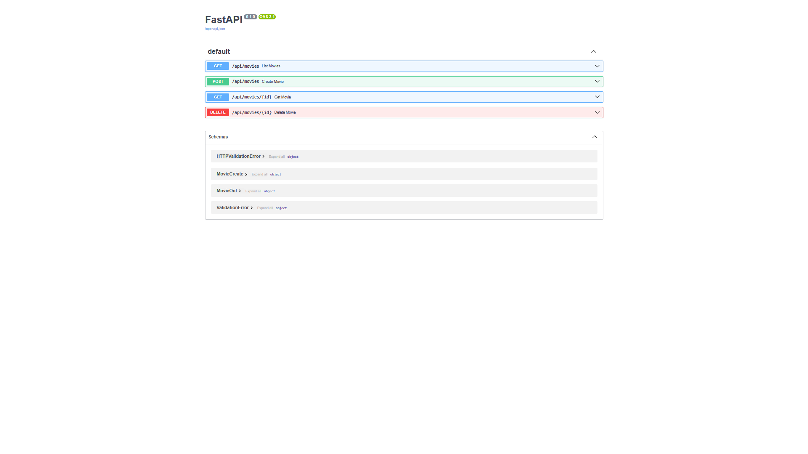

# README.md

# omdb-movies-api-plataform-builders 🚀🎬

> Projeto desenvolvido como teste técnico para a vaga de **Desenvolvedor(a) Python** na empresa **[\[Plataform Builders\]](https://www.platformbuilders.io/)**.

API REST assíncrona em Python com FastAPI para cadastro e consulta de filmes,  
com dados complementares obtidos da API externa OMDb.  
Inclui frontend simples em HTML/JS para facilitar a interação e testes.

---

## 🎯 Objetivo

Desenvolver uma API com três endpoints para:  
- Cadastrar filmes pelo título, buscando dados adicionais (ano, diretor, sinopse, nota IMDb) na OMDb  
- Consultar filmes por ID  
- Listar todos os filmes cadastrados

---

## 🛠 Tecnologias e libs usadas

- [FastAPI](https://fastapi.tiangolo.com/) (async, fácil e rápido para APIs)  
- [httpx](https://www.python-httpx.org/) (cliente HTTP async para buscar OMDb)  
- [SQLAlchemy](https://www.sqlalchemy.org/) (ORM para banco SQLite)  
- [Jinja2](https://jinja.palletsprojects.com/) (renderização de templates HTML)  
- JavaScript + HTML para frontend simples

---

## ⚙️ Pré-requisitos

- Python 3.9+  
- OMDb API key (gratuita): crie a sua em: [https://www.omdbapi.com/apikey.aspx](https://www.omdbapi.com/apikey.aspx) 

---

## 🚀 Setup e execução

1. Clone o repositório:

```bash
git clone https://github.com/henriquerodrigues-dev/omdb-movies-api-platform-builders
cd omdb-movies-api
```

2. Crie e ative seu ambiente virtual:
```bash
python -m venv venv
source venv/bin/activate  # Linux/macOS
venv\Scripts\activate     # Windows
```
Instale dependências:
```bash
pip install -r requirements.txt
```

4. Crie o arquivo .env na raiz do projeto com o conteúdo:
```bash
OMDB_API_KEY=your_api_key_here
```
> (Substitua o valor '**your_api_key_here**' pela sua chave OMDb obtida no site)

5. Rode a aplicação:
```bash
uvicorn main:app --reload
```
> A API estará disponível em: http://localhost:8000 ou http://localhost:8000/docs

## 🖥️ Uso

### Frontend web

Abra no navegador a página principal:
```
http://localhost:8000/
```

Lá você pode:

- 🎬 Cadastrar um filme pelo título (ex: Spider-Man)

- 📃 Listar todos os filmes cadastrados

- 🔍 Buscar um filme por ID

- 🗑️ Deletar um filme da lista com um clique na lixeira ao lado do título

Também tem botão para ir direto para o Swagger, onde pode testar os endpoints facilmente.

### 🧩 Endpoints da API (prefixo `/api`)

| Método | Endpoint             | Descrição                                     |
|--------|----------------------|---------------------------------------------- |
| POST   | `/api/movies`        | Cadastra filme pelo título (busca dados OMDb) |
| GET    | `/api/movies`        | Lista todos os filmes cadastrados             |
| GET    | `/api/movies/{id}`   | Busca filme pelo ID                           |
| DELETE |	`/api/movies/{id}`  | Remove um filme do banco de dados por ID 🗑️   |

---

## 🗂️ Estrutura do projeto (modular)

```bash
├── app/
│ ├── crud.py # Lógica dos endpoints e chamadas OMDb
│ ├── database.py # Configuração do banco SQLite e sessão
│ ├── main.py # Ponto de entrada da aplicação FastAPI
│ ├── models.py # Modelos ORM SQLAlchemy (Filme)
│ ├── omdb.py # Cliente e funções para API OMDb
│ └── schemes.py # Schemas Pydantic para validação de dados
├── screenshots/ # Imagens para o README e documentação
├── static/
│ └── script.js # JavaScript do frontend
├── templates/
│ └── index.html # Página principal frontend
├── .env # Variáveis de ambiente (não versionado)
├── .gitignore # Arquivos e pastas ignorados pelo Git
├── requirements.txt # Dependências do projeto
└── README.md # Documentação do projeto
```

## 📸 Screenshots





---

## 🙋‍♂️ Autor

Feito por **Henrique Rodrigues**

[](https://www.linkedin.com/in/henriquerodrigues-dev/)
[](https://github.com/henriquerodrigues-dev)

